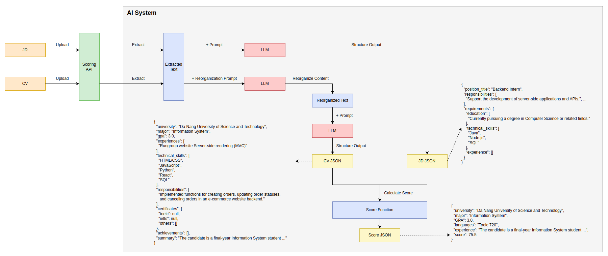

# ECO AGRI AI
## Description📝
-ECO AGRI

## System Architecture 🏗

## Installation ⚡️
### Requires
- Python 3.10 or higher

Create `.env` file as `template.env`

## Run app with uvicorn 🚀
~~~
python -m venv venv
source venv/bin/activate
pip install -r requirements.txt
uvicorn app.main:app --host 127.0.0.1 --port 8001 --reload
~~~

## Tree directory 🌗
~~~
app
├── api                  - web related stuff.
│   ├── errors           - definition of error handlers.
│   └── routes           - web routes.
│   └── services         - logic that is not just crud related.
│   └── schemas          - pydantic models for request and response.
│   └── responses        - response for api request corresponding.
│   └── helpers          - helper functions.
├── core                 - application configuration, startup events, logging.
├── logger               - export log for server process.
├── tests                - test api, code.
├── resources            - image, audio, csv, etc. (ignore)
├── pyproject.toml       - dependencies and package.
└── main.py              - FastAPI application creation and configuration.
~~~
